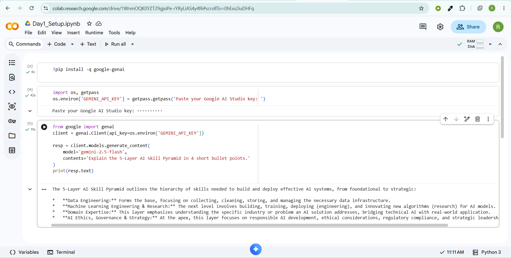
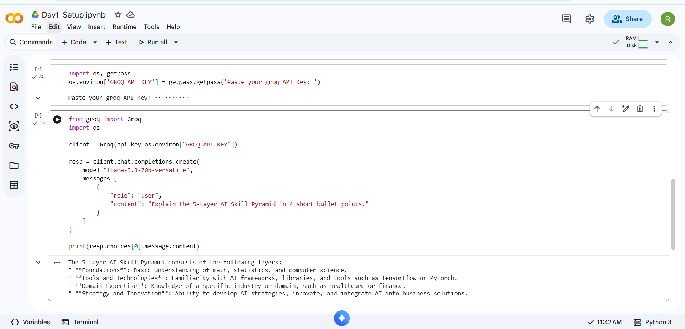
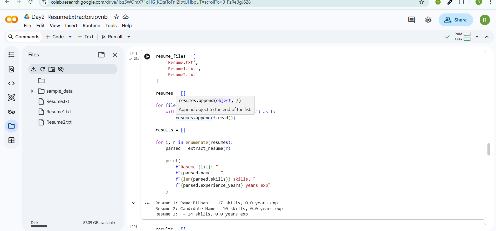
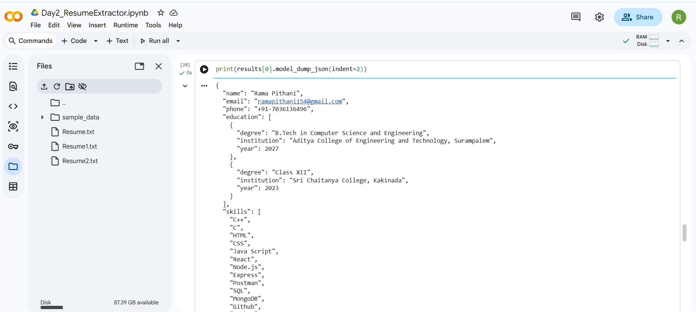
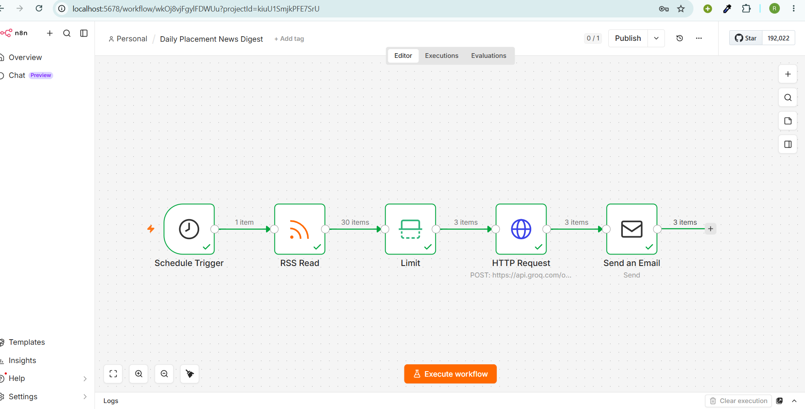
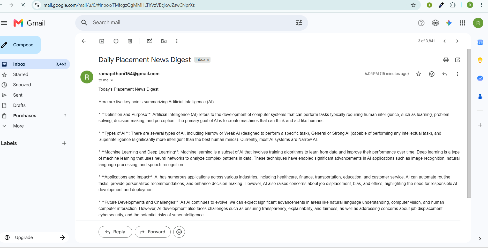

# AI Mentor Bootcamp — Venkata Naga Rama Pithani

https://github.com/23MH1A05L3/AI-workshop

Public portfolio of 12-day AI Trainer Workshop. By Day 12: 6 daily notebooks + capstone Streamlit URL.
## Day 1 — Setup complete

- ✅ Google AI Studio API key provisioned
- ✅ Groq API key provisioned
- ✅ Hello-Gemini and Groq call working — see [Day1_Setup.ipynb](Day1_Setup.ipynb)
- 4-tool comparison matrix from Lab 1A: see screenshot below

## Day 2 Lab 2B – JSON Resume Extractor
Objective

Build an AI-powered resume extraction pipeline that converts unstructured resume text into structured JSON using Gemini's Structured Output API and validates the output using Pydantic.

### Technologies Used
  Python
  Google Gemini 2.5 Flash
  Pydantic
  Google Colab
### Implementation
  Defined a structured Resume schema using Pydantic models.
  Configured Gemini Structured Output using response_schema.
  Extracted candidate information from resume text into JSON format.
  Validated model output against the predefined schema.
  Implemented retry logic to repair malformed JSON responses.
  Processed multiple resumes and converted them into structured data objects.
  Added validation for empty input and handled extraction failures gracefully.
### Fields Extracted
  Name
  Email
  Phone Number
  Education Details
  Skills
  Projects
  Experience (Years)
  

## Day4

### Lab 4a-Productivity Sprint

**Company:** YugabyteDB (SDET Intern)

#### Edit Notes

  1. Verified stipend as ₹80,000/month using the official placement notice.
  2. CTC figures varied across sources; marked as "[verify with official offer letter]".
  3. Replaced Gamma's generic cover title with a YugabyteDB-specific tagline.

#### Files

  * `Day4_Yugabyte_brief.pdf`
  * `Day4_Yugabyte_deck.pdf`

#### Sources

  * Official placement notice
  * Glassdoor interviews
  * eLitmus job posting
  * Greenhouse SDET JD
  * YugabyteDB internship blogs
  * BusinessWire
  * Tracxn

### Lab 4B: n8n Daily News Digest

A self-hosted, automated workflow that fetches daily placement and tech news via RSS, processes and summarizes the text using the Groq API, and emails a concise 5-bullet digest every morning.

## 🛠️ Tech Stack & Workflow

*   **Host:** Self-hosted via Docker (`docker-compose`)
*   **Automation Engine:** n8n
*   **LLM API:** Groq (`api.groq.com/openai/v1/chat/completions`)
*   **Delivery:** Gmail / SMTP Node

### Workflow Architecture

`Schedule Trigger (7:00 AM IST)` ➔ `RSS Read Node` ➔ `HTTP Request (Groq API)` ➔ `Gmail / SMTP Send Node`
---

## 📦 Deliverables

*   ✅ **Workflow JSON:** [Day4_NewsDigest.json](Day4_NewsDigest.json)
*   ✅ **Status:** Active & Automated

### Verification Screenshot

